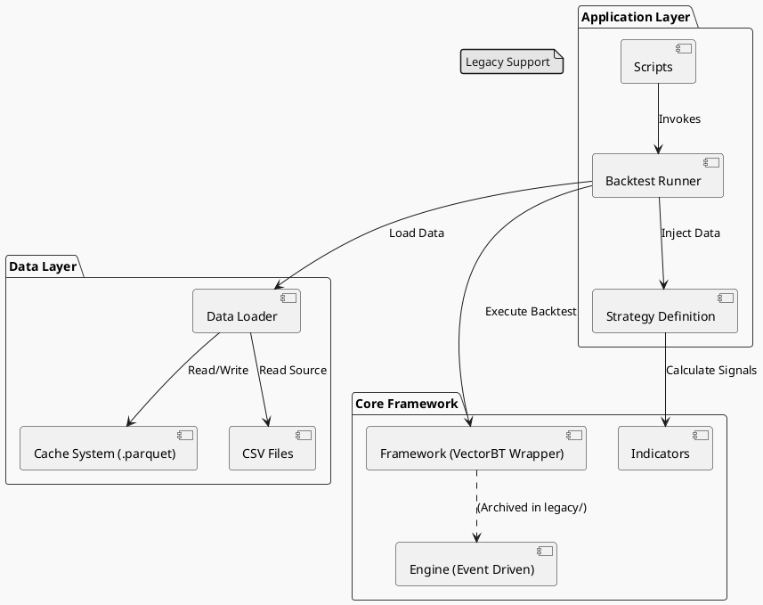

# vbt_backtesting 项目概览

## 1. 项目简介

本项目是一个基于 `vectorbt` 的高性能量化回测框架，旨在提供快速、灵活的策略开发与验证环境。核心设计遵循 **KISS (Keep It Simple, Stupid)** 原则，通过向量化计算实现极速回测，同时保留事件驱动的扩展能力。

## 2. 系统架构

核心架构分为数据层、计算层（VectorBT）、执行层和应用层。



## 2.5 依赖与安装

项目根目录提供 `requirements.txt`，安装 Python 依赖：

```bash
# 建议在虚拟环境中安装
python3 -m venv .venv
source .venv/bin/activate   # Windows: .venv\Scripts\activate

pip install -r requirements.txt
```

- **TA-Lib**：需先安装 C 库再 pip 安装。macOS：`brew install ta-lib`；Linux 需编译 [ta-lib](https://ta-lib.org/) 源码。
- **watch_metric**（`watch_stock/watch_metric.py`）最小依赖：`pandas`、`numpy`；形态展示需 `TA-Lib`。
- 数据下载脚本（`scripts/data_tools`）需额外安装 `longport-openapi`（见 requirements.txt 注释）。

## 3. 核心模块

### 3.1 核心框架 (`backtesting/`)

| 文件/模块            | 职责描述                                                                                                                                   |
| :------------------- | :----------------------------------------------------------------------------------------------------------------------------------------- |
| **`framework.py`**   | **核心驱动**。封装 `vectorbt`，处理数据对齐、预计算指标、多进程参数寻优 (`run_optimization`)、全周期回测 (`run_full_cycle`) 及交互式绘图。 |
| **`indicators.py`**  | **指标库**。封装 TA-Lib 或自定义指标计算逻辑（如 KDJ, ATR, Volume Breakout），支持向量化计算。                                             |
| **`data_loader.py`** | **数据加载**。负责从 CSV 读取原始数据，清洗并按时间戳对齐。                                                                                |
| **`legacy/`**        | **归档模块**。包含原事件驱动引擎 `engine.py` 及基于此的策略 `strategies/`，保留以备未来参考。                                              |

### 3.2 策略与脚本 (`scripts/`)

- **`run_struct.py`**: 标准策略执行入口。展示了如何定义纯函数策略逻辑、设置参数网格、并调用 `Runner` 进行全流程回测（寻优 -> 验证 -> 报告）。
- **`analyze_kdj_frequency.py`**: 特定分析脚本，用于统计指标分布特征。

## 4. 开发工作流 (Development Workflow)

遵循 **渐进式开发** 与 **结构化流程**：

1.  **构思策略** (`Planning`)：在 `strategie_input_require.md` 中定义策略逻辑、核心指标及寻优参数。
2.  **实现逻辑** (`Implementation`)：在 `scripts/` 下创建脚本，实现策略函数（Pure Function）。
3.  **参数寻优** (`Optimization`)：使用 `runner.run_optimization` 进行网格搜索，利用多进程加速。
4.  **结果验证** (`Verification`)：
    -   **样本外验证**：自动拆分训练集/验证集。
    -   **可视化分析**：生成交互式 HTML 图表，检查进出场点位与指标状态。

## 5. 关键特性 (Key Features)

-   **高性能向量化**：基于 `vectorbt`，支持百万级数据点的秒级回测。
-   **智能缓存**：由 `framework.py` 自动维护 Parquet 缓存，避免重复解析 CSV，极大提升加载速度。
-   **自动化报告**：集成 Telegram 通知与 HTML 图表生成，通过 `plot_trades` 直观展示交易细节。
-   **灵活扩展**：支持自定义预计算指标 (`set_precompute_indicators`)，优化大规模参数搜索时的计算效率。

## 6. 即将进行的任务

- [ ] 完善策略库构建。
- [ ] 探索实盘对接可能性（参考 `legacy/engine.py`）。
- [ ] 补充更多单元测试以确保指标计算的准确性。
